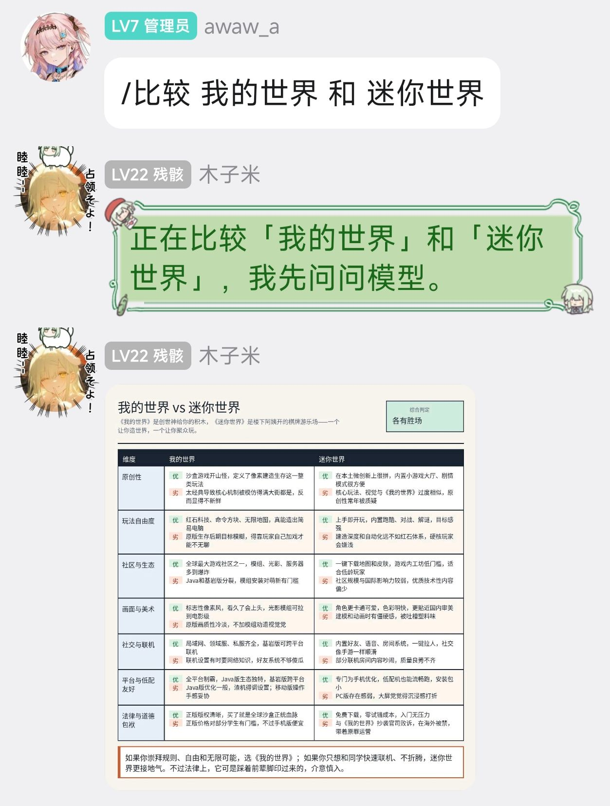

# astrbot-plugin-compare

一个 AstrBot 群聊对比插件。群友问“两样东西谁更厉害”时，插件会调用当前会话配置的 LLM，分维度列出两者优劣，最后在本地生成 PNG 图片发送。

## 功能

- 支持 `/compare`、`/比较`、`/对比`、`/谁强`。
- 自动调用当前会话使用的聊天模型。
- 使用 Pillow 在本地生成 PNG 图片，不依赖 AstrBot 的 t2i 网络渲染端点。
- 输出包含多个维度、双方优劣、综合判定和最终结论的图片。

## 效果展示



## 用法

```text
/compare Python vs Java
/比较 可口可乐 和 百事可乐
/对比 iPhone 17 与 Android 旗舰
```

## 安装

1. 把本文件夹放到 AstrBot 的 `data/plugins/` 目录。
2. 确认插件目录里有 `requirements.txt`，内容包含 `Pillow>=10.0.0`。
3. 重启 AstrBot，或在 WebUI 的插件管理里重新加载插件，让 AstrBot 安装依赖。
4. 如果提示缺少 Pillow，请在 AstrBot WebUI 的 `控制台` -> `安装 Pip 包` 中安装 `Pillow`。
5. 插件已在 `fonts/` 目录内置 Noto Sans CJK 简体中文字体，正常情况下不需要在容器里额外安装中文字体。
   - 如果你删掉了内置字体，可以放入其他中文字体，或设置环境变量 `ASTRBOT_COMPARE_FONT=/path/to/font.ttc`。
   - 粗体可选设置 `ASTRBOT_COMPARE_BOLD_FONT=/path/to/bold-font.ttc`；未设置时会回退使用常规字体。
6. 确保 AstrBot 已经配置可用的 LLM 提供商。
7. 在群聊或私聊里发送上面的命令测试。

## 内置字体

`fonts/NotoSansCJKsc-Regular.otf` 来自 notofonts/noto-cjk，使用 SIL Open Font License 1.1，可随插件分发。

## 开发说明

- 插件入口：`main.py`
- LLM 调用：`Context.llm_generate`
- 图片生成：`Pillow`
- 图片发送：`event.image_result(本地 PNG 路径)`
